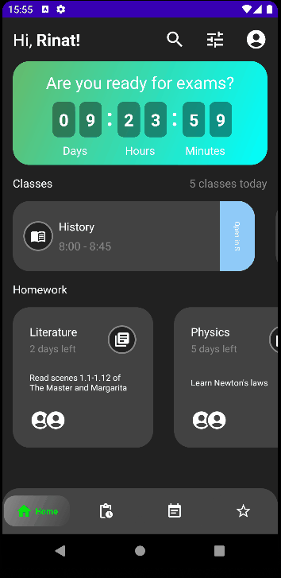
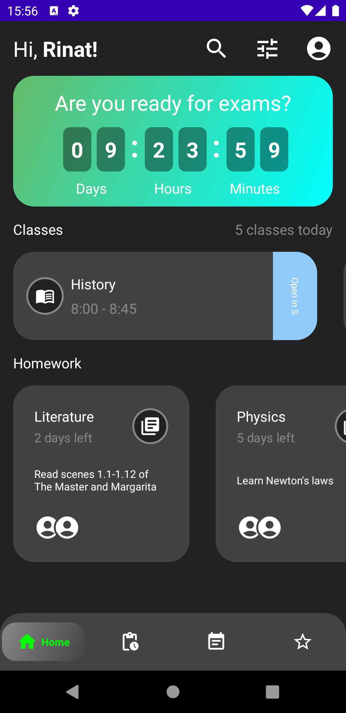
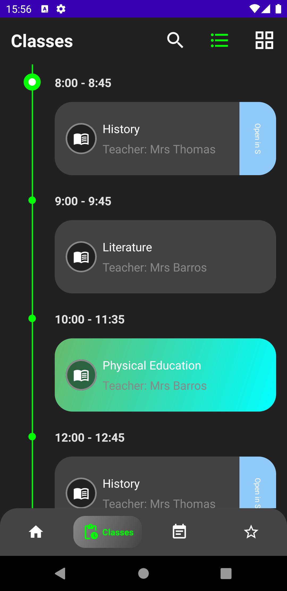

# Домашнее задание 4.
Напишите приложение, которое состоит из двух экранов, с табами снизу. На первом табе приложение должно показывать список из трех секций, данные можно брать из какого-то мокового источника (можно для этого использовать гитхаб, например, или файлы, или создание объектов из кода), либо из открытых API (https://courses.edx.org/api-docs/).  
● В первой секции оповещение с таймером до начала экзаменов;  
● Во второй секции горизонтальный список с уроками на день, при этом скролл должен находится на ближайшем или текущем уроке;  
● В третьей секции горизонтальный список домашних заданий с кратким описанием ДЗ и временем до сдачи ДЗ.  
На втором табе приложение должно показывать расписание уроков в хронологическом порядке (черные карточки) и информации о дополнительных занятиях (зеленая карточка). При тапе на карточку, у которой есть шеврон Open In справа — нужно открывать Скайп. Остальные табы могут быть либо некликабельные, либо с полноэкранной заглушкой. Реализация поиска и фильтра — по желанию.  
Выбор архитектуры и библиотек остается за вами, но желательно использовать SOLID, Clean, MVVM или MVP, MVI. Будет плюсом DI (Koin, Dagger, Toothpick). Наличие тестов будет плюсом. Дизайн не обязательно должен быть как на макетах, но желательно.

# Получившийся результат.

Написано на Jetpack Compose.

**Что было сделано:**
1. Создан новый проект Empty Compose Activity.
2. Реализован первый экран с 3 секциями. 
3. Реализован второй экран со списком уроков на временной шкале.
4. Реализован BottomNavigationBar.
5. Для навигации использована библиотека Navigation Component.
6. Для DI использована библиотека Koin.
7. Данные берутся из репозитория со статическими данными DummyRepositoryImpl.
8. Попытался реализовать максимальное подобие того, что было изображено на макете.
9. На текущий момент нажимать можно только по иконкам в BottomNavigationBar.

  

