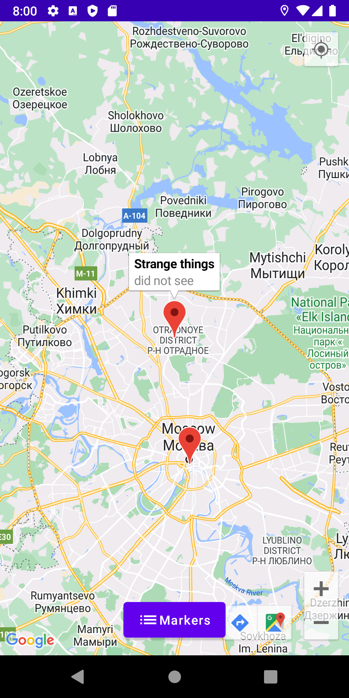
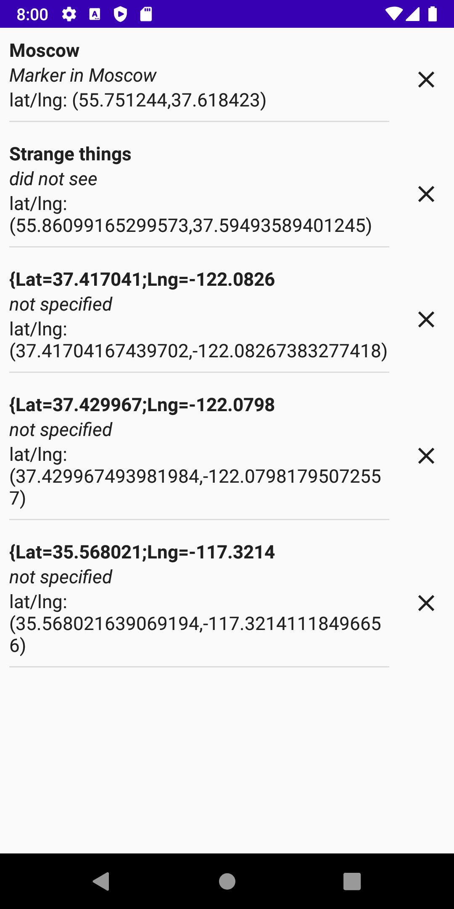
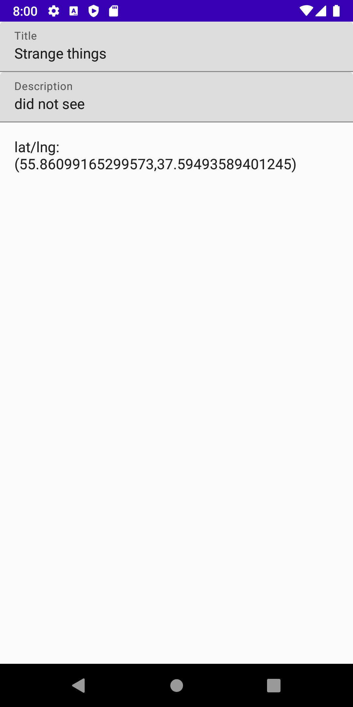

# Домашнее задание 1.
1. Создать приложение с основным экраном в виде карты и следующими требованиями: 
    1) Приложение должно находить устройство по геолокации. 
    2) На карте можно ставить маркеры. 
    3) На отдельном экране можно посмотреть и отредактировать список маркеров, добавить к маркеру название и аннотацию. 
    4) Выбор архитектуры и библиотек остается за вами.
2. Рассказать про Singleton, и почему иногда его называют антипаттерн

# Получившийся результат.

Так как нет ограничений в архитектуре и библиотеках, решил попробовать реализовать приложение на Jetpack Compose. Давно хотел поизучать Jetpack Compose и заодно что-нибудь сделать.

Что было сделано:
1. Создан новый проект Empty Compose Activity.
2. Главный экран реализован в виде карты на весь экран. По нажатию на карте устанавливается Marker. Также доступно определение геопозиции.
3. По нажатию на кнопку Markers можно перейти на экран со списком маркеров. Реализован механизм удаления из списка по нажатию на крестик на против элемента списка.
4. По нажатию на элемент списка маркеров можно перейти на экран описания маркера, там можно изменить заголовок и описание.
5. Для навигации использовал Navigation Component.
6. Реализован запрос разрешения на геолокацию.
7. Использовал одну ViewModel для всего приложения, чтобы хранить состояние.
8. На текущий момент список маркеров хранится в оперативной памяти, сохранение в БД не реализовано.  
9. Google api key хранится в apikey.properties в формате google_api_key=KEY. Ранее был добавлен в gitignore.

  

Singleton - это паттерн проектирования, который гарантирует, что у класса есть только один экземпляр с глобальной точкой доступа. Антипаттерн наверное из-за того, что реализует большую связность приложения, также может нарушать принцип единственной ответственности.