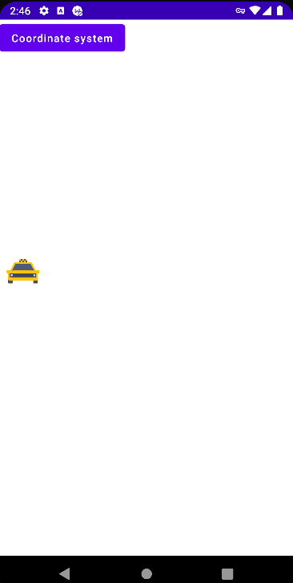
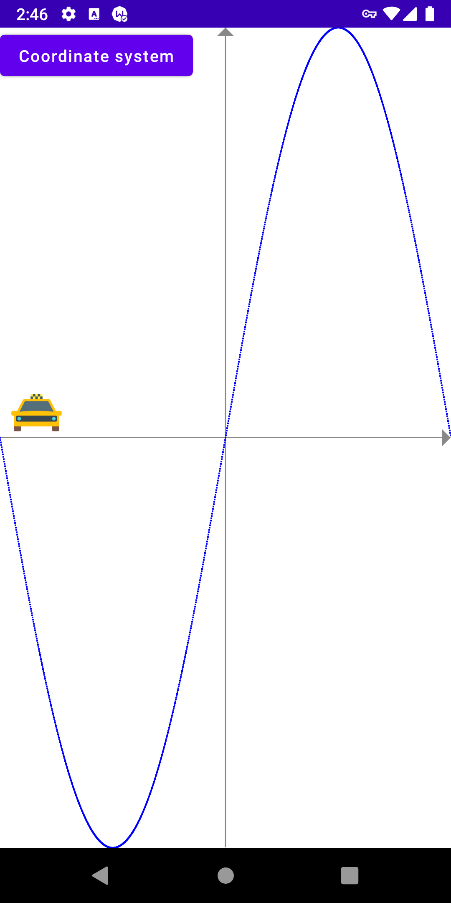

# Домашнее задание 3.
**Напишите приложение, которое:**
1. Отображает макет машины как в приложении Я.Гоу или СитиМобил;
2. По тапу на машину она едет по не прямой траектории из одного угла в другой.
3. Выбор архитектуры и библиотек остается за вами, но желательно использовать SOLID, Clean, MVVM или MVP, MVI. Будет плюсом DI (Koin, Dagger, Toothpick). Наличие тестов будет плюсом.

# Получившийся результат.

Написано на Jetpack Compose.

**Что было сделано:**
1. Создан новый проект Empty Compose Activity.
2. Реализовано движение объекта по синусоиде.
3. Если нажать на кнопку 'Coordinate system', то отобразиться система координат с синусоидой, которая и является траекторией движения объекта.
4. Система координат и синусоида нарисованы на Canvas.
5. движение начинается по нажатию на иконку такси.
6. Столкнулся с проблемой, что при включенной системе координат и синусоиде лагает главный поток. Судя по всему Canvas всё время перерисовывается, как и синусоида из 1980 точек. Пока не разобрался, можно ли это починить.  

  
  

