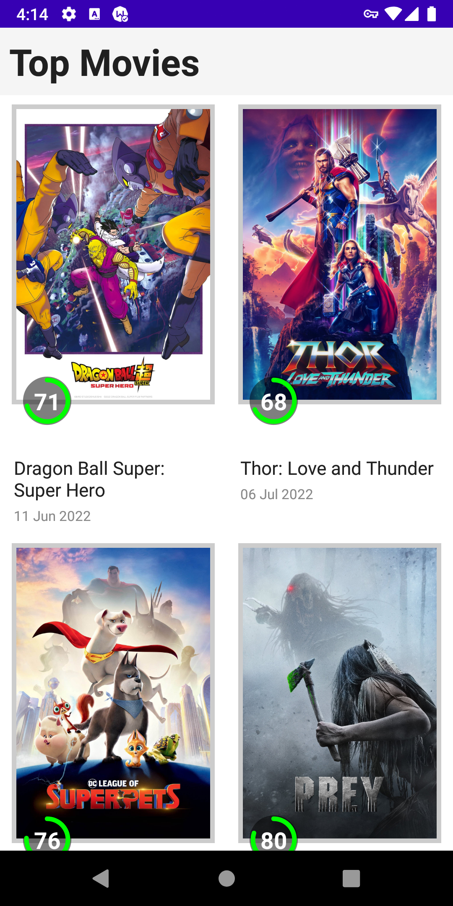
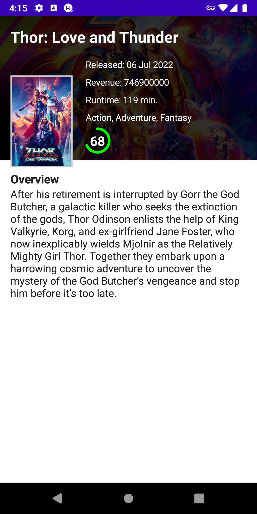

# Домашнее задание 2.
Напишите приложение по дизайну ниже, которое:
1. Отображает список фильмов и поддерживает пагинацию. API можно найти по ссылке;
2. При тапе на элемент списка должен отображаться экран с описанием выбранного фильма;
3. Опционально:
    - иконка рейтинга фильма,
    - список актеров и их фото,
    - поиск по фильмам на главном экране,
    - тесты.

# Получившийся результат.

Продолжил изучение Jetpack Compose.

* Что было сделано:
1. Создан новый проект Empty Compose Activity.
2. Главный экран реализован в виде списка фильмов. Подгружаются Top Movies с themoviedb.org.
3. Для дозагрузки списка фильмов использована библиотека Paging 3.
4. Для навигации использована библиотека Navigation Component.
5. Для DI использована библиотека Koin.
6. Реализованы 2 экрана: главный со списком фильмов и экран детальной информации.
7. Для загрузки изображений использована библиотека Coil.
8. Реализовано отображение рейтинга фильмов с анимацией.
9. The MovieDb api key хранится в apikey.properties в формате moviedb_api_key=KEY. Ранее был добавлен в gitignore.

  

