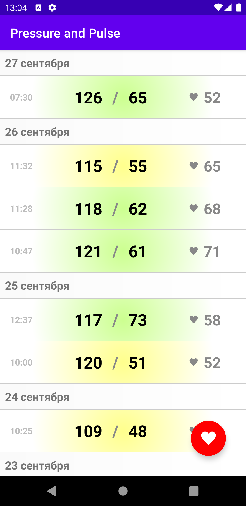
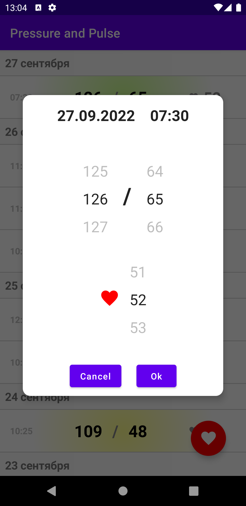
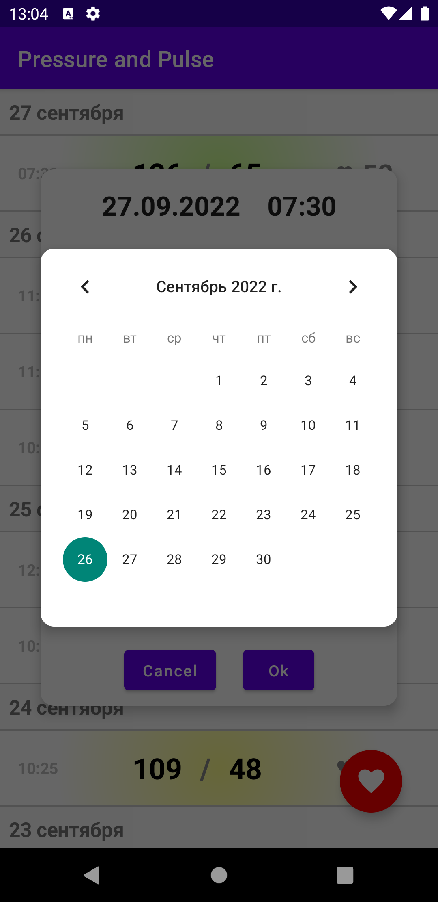
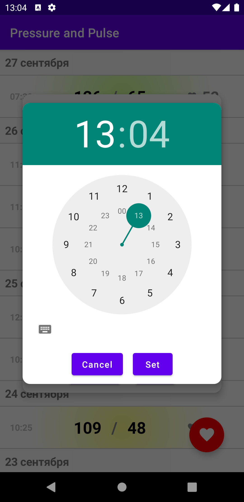

# Домашнее задание 6.
Напишите приложение, которое хранит и отображает давление и пульс пользователя по времени. В приложении всего один экран, отображающий данные в списке, разделенным по дням и часам. По нажатию на FAB вводятся новые данные. Все данные необходимо хранить в Firestore и не хранить их на устройстве.  
Выбор архитектуры и библиотек остается за вами. Дизайн не обязательно должен быть как на макете, но желательно.

# Получившийся результат.

Написано на Jetpack Compose.

**Что было сделано:**
1. Создан новый проект Empty Compose Activity.
2. Реализован MeasurementsRepository.
3. В проекте используется Firebase Firestore. Все данные хранятся там.
4. Для DI использована библиотека Koin.
5. Единственный экран реализован в виде списка измерений. Ввод нового измерения осуществляется через FAB.
6. Реализован экран диалога для ввода нового или изменения существущего измерения.

  

