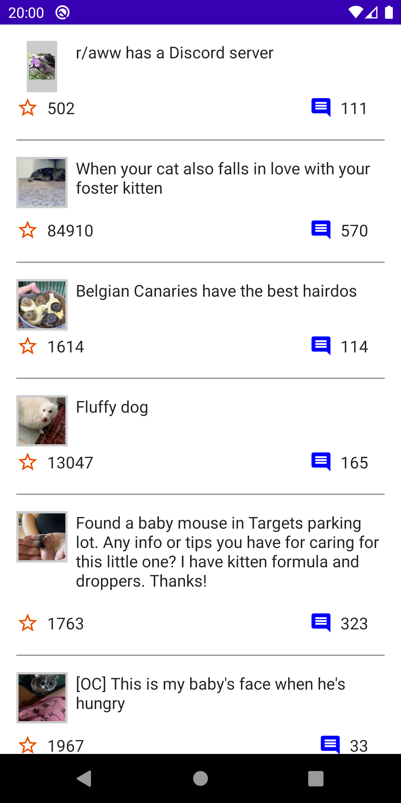

# Домашнее задание 5.
Напишите приложение, которое умеет работать с бесконечным списком. В качестве API используйте запросы популярных постов с Reddit.  
● В приложении единственный экран, который отображает список популярных постов на Реддите;  
● Промотка списка идет не постранично, а динамически: новые посты подгружаются, пока пользователь проматывает список.  
Выбор архитектуры и библиотек остается за вами, но желательно использовать Paging 3.0, Room в связке с Paging. Room использовать как локальный кэш данных. Дизайн не обязательно должен быть как на макете, но желательно.

# Получившийся результат.

Написано на Jetpack Compose.

**Что было сделано:**
1. Создан новый проект Empty Compose Activity.
2. С помощью Retrofit реализован RedditService.
3. Реализован RedditRepository.
4. Для DI использована библиотека Koin.
5. Единственный экран реализован в виде списка постов.
6. Для дозагрузки списка постов использована библиотека Paging 3.
7. Для загрузки изображений использована библиотека Coil.

  

